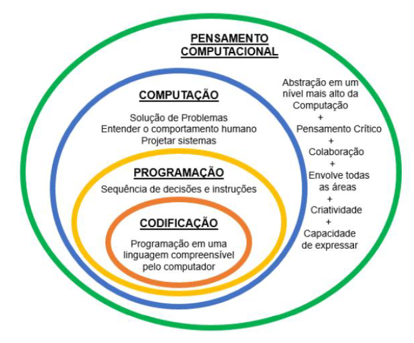
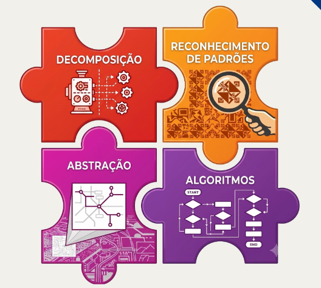
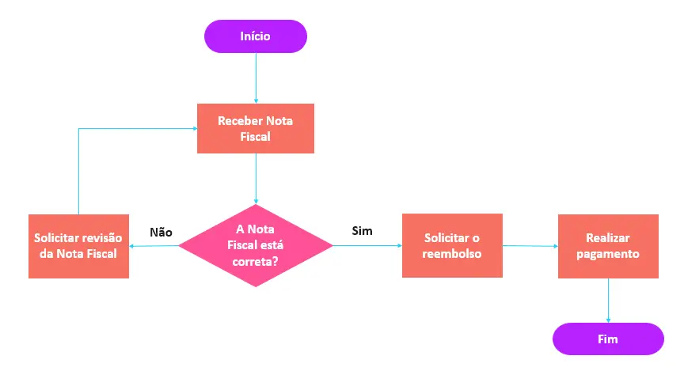
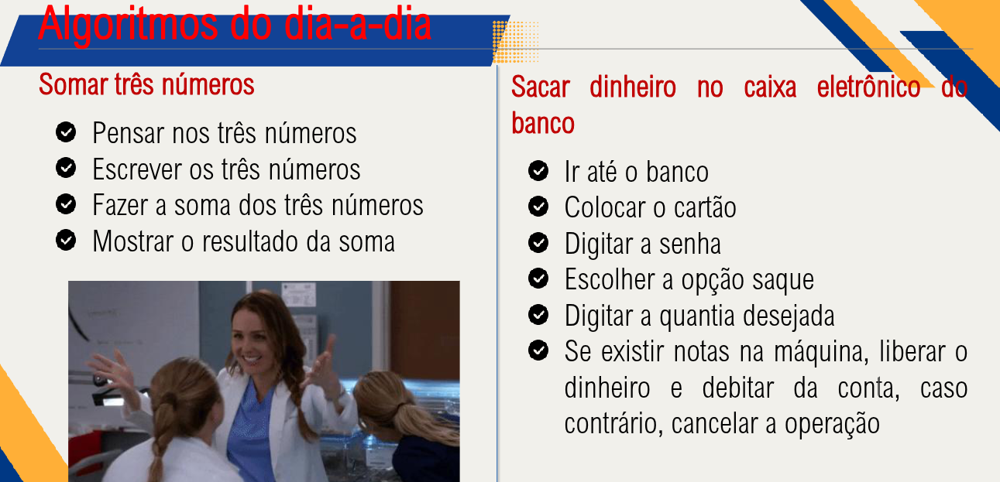

# Aula 01 - Pensamentos Computacional

## Conteúdo

1. Pensamento Computacional
2. Fronteira entre o PC e a Computação
3. Pilares do Pensamento Computacional
4. Algoritmos
    - Algoritmo em fluxograma
    - Algoritmo do dia a dia

---

## 1. Pensamento Computacional

O Pensamento Computacional é o conjuto de habilidades e competências da ciência da computação que pode ser aplicados á solução de problemas práticos

Podemos dizer que o Pensamento Computacinla é um processo de solução de problemas que inclui diversas caracteristica, algumas delas são:

- Formulação de problemas que nos permite usar o computador e outras ferramentas para nos ajudalos resove-los 
- Organização e análise lógica de dados
- Representação de dados através de abstrações, como modelos e simulações

## 2. Fronteira entre o PC e a Computação

## 3. Pilares do Pensamento Computacional

Para tornar mais eficiente a solução de problemas, o pesamento computacional está baseado em 4 pilares

- Decomposição
- Reconhecimento de padroẽs
- Abstração 
- Algoritmo

## 4. Algoritmo

Algoritmo na computação pode ser definido em uma sequencia de instruções ou operações básicas, onde o tempo de execução é finito e resolve um problema pratico

### Algoritmo em fluxograma

### Algoritmo do dia a dia

