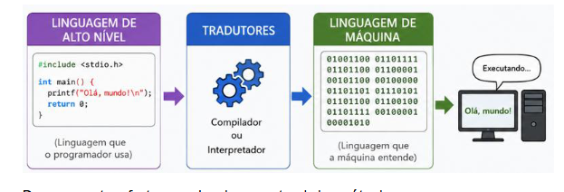
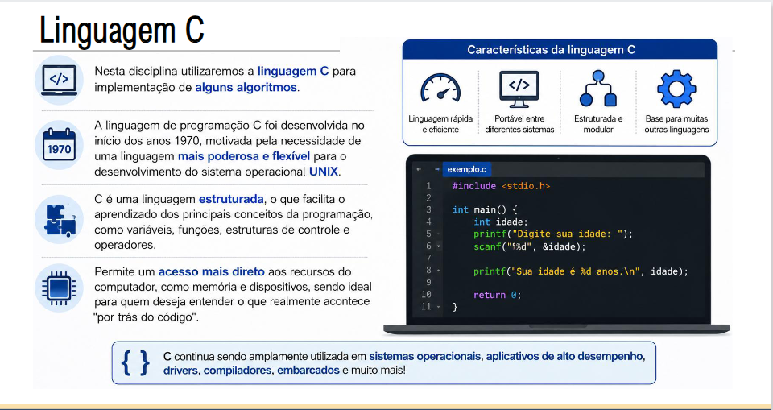
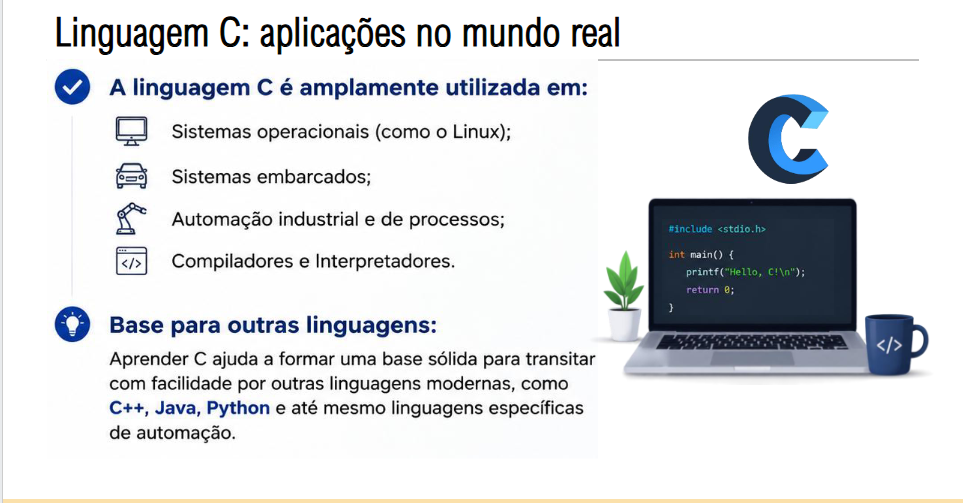
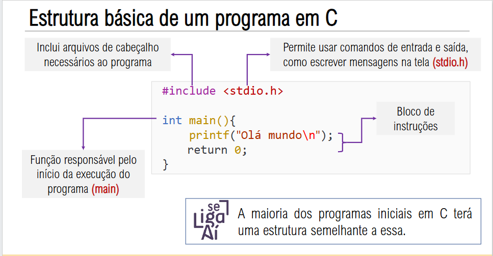
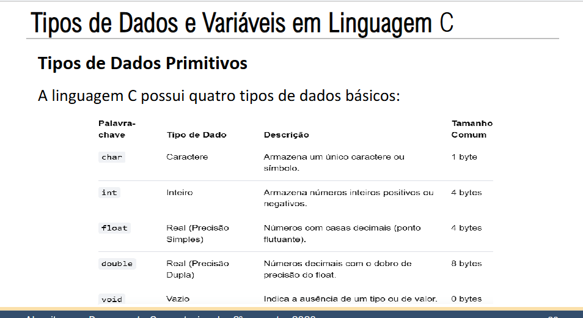
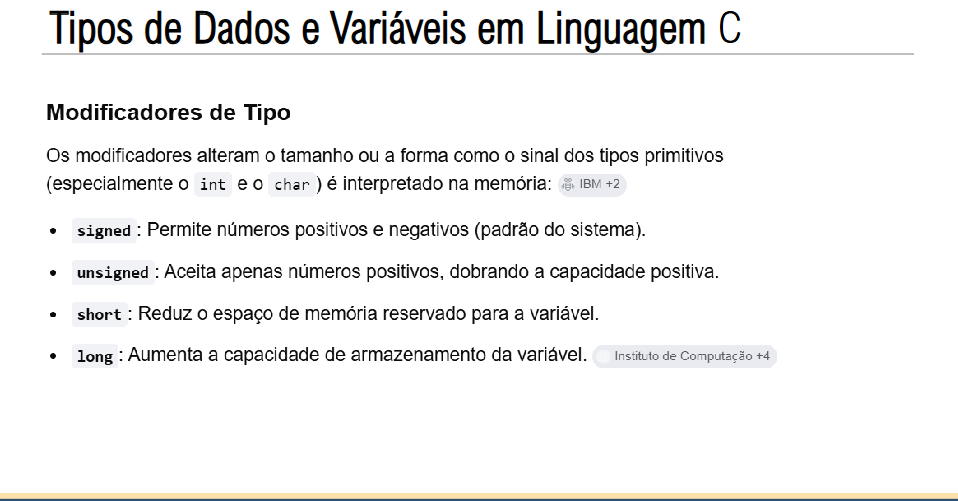
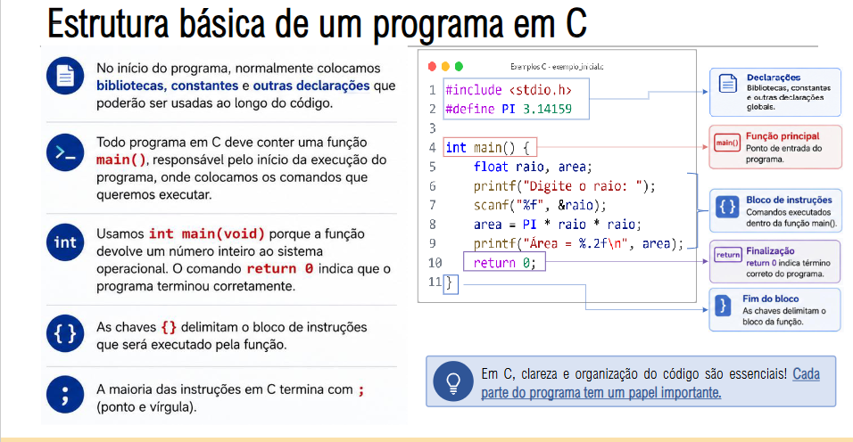
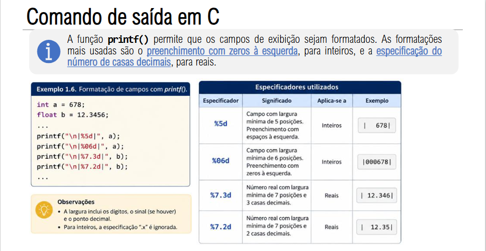

# Aula 02 - Algoritmos e Pensamento Computacional

## Conteúdo
- Introdução à Programação em C
- Elaborado com o auxílio do Gemini, do Google

---

## O que é um Programa de Computador

São instruções escritas em uma linguagem que permite a comunicação entre o programador e o computador (0s e 1s) => Linguagem de programação.

## Linguagens de Programação

Uma linguagem natural ou idioma (português, inglês, espanhol, etc.) estabelece um vocabulário ou dicionário válido e um grupo de regras sintáticas e semânticas para que as pessoas se expressem adequadamente nessa linguagem e se comuniquem.

De forma semelhante, uma linguagem de programação estabelece um conjunto de regras sintáticas para escrever códigos válidos, a fim de que os computadores possam executar uma determinada função.

## Como a máquina entende os códigos

Para que o computador "entenda" um programa, é necessário um meio de tradução entre a linguagem de alto nível utilizada no programa e a linguagem de máquina.



- Compilador: traduz o programa escrito em uma linguagem de programação para um programa executável.

- Interpretador: traduz e executa o programa linha por linha.

## Linguagens de Programação

As linguagens de programação classificam-se principalmente pelo nível de abstração, que é a proximidade com o hardware ou com o ser humano, e pelo paradigma de programação, que é a forma como estruturam as instruções e os dados.

Cada tipo atende a necessidades específicas do desenvolvimento de software.

1. Níveis de Abstração (Proximidade com a Máquina)

- Baixo Nível: Linguagens com instruções diretas para o processador. Em inglês, são quase incompreensíveis para humanos. Exemplos: Assembly e código binário.

- Alto Nível: Linguagens distantes do hardware que usam comandos em inglês. São fáceis de ler, escrever e manter. Exemplos: Python, Java e JavaScript.

2. Paradigmas de Programação (Modelos de Desenvolvimento)

Os paradigmas definem a abordagem lógica usada pelo programador para estruturar o código.

- Imperativo: Foca em como a tarefa deve ser feita, listando comandos passo a passo para o computador alterar seu estado. Exemplo: C.

- Orientado a Objetos (POO): Organiza o código em "objetos" da vida real, agrupando dados e funções em uma mesma estrutura. Exemplos: Java e C#.

- Funcional: Trata a computação como a avaliação de funções matemáticas isoladas, evitando dados mutáveis. Exemplos: Haskell e Elixir.

- Lógico (Declarativo): Foca no que deve ser resolvido em vez de como resolver. O programa usa fatos e regras para deduzir respostas. Exemplo: Prolog.

## Linguagem C







## Tipos de Dados e Variáveis em Linguagem C

Em linguagem C, variáveis são espaços reservados na memória para armazenar dados, e cada uma deve possuir um tipo de dado fixo e declarado previamente. Como C é uma linguagem fortemente e estaticamente tipada, o tipo define o tamanho que a variável ocupará na memória e como os bits armazenados serão interpretados.





## Regras para a Criação de Variáveis

Para nomear variáveis em C, é obrigatório seguir estas regras de sintaxe:

- Apenas letras, números e sublinhados (_): Não use espaços ou símbolos especiais.
- Início obrigatório: Deve começar sempre com uma letra ou sublinhado, nunca com números.
- Case Sensitive: A linguagem diferencia maiúsculas de minúsculas (`idade` é diferente de `Idade`).
- Palavras reservadas: Símbolos e instruções nativas da linguagem (como `int`, `float`, `return`) não podem ser nomes de variáveis.



## Comando de saída em C



## Exemplo Prático de Declaração e Atribuição

O código abaixo exemplifica como declarar, inicializar e exibir variáveis em um programa estruturado:

```c
int main() {
    int idade = 26;
    float altura = 1.75;
    unsigned int id_usuario = 45500;
    char inicial = 'A';

    printf("Idade: %d anos\n", idade);
    printf("Altura: %.2f metros\n", altura);
    printf("Inicial do nome: %c\n", inicial);
    printf("Id do Usuario: %u\n", id_usuario);

    return 0;
}
