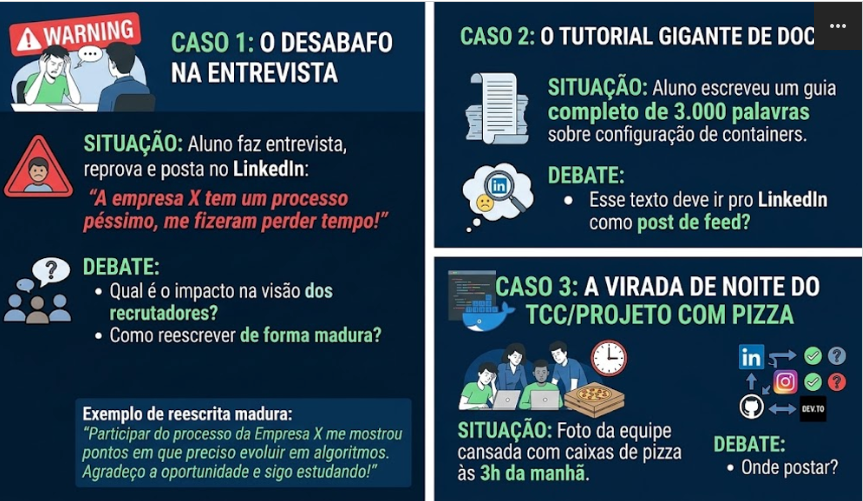

# Aula 02 - Debate em Sala: Análise Crítica de Postagens

## Conteúdo

1.  Discussão e Elaboração: O objetivo é que vocês leiam e discutam em grupo cada um dos casos. Vocês devem analisar:

    - Qual a mensagem principal?
    - Que tipo de reação a postagem gerou?
    - Qual é a opinião do grupo sobre a postagem?
---

---

## 1. Discussão e Elaboração

## Caso 3

A proposta da resenha do caso 3, gerou um debate interessante começamos com a seguinte pergunta para o grupo “Você postaria a foto independente da Rede Social?” todos concordamos em postar. Chegando na proxima pergunta, “em qual Rede é mais apropriado?” os votos foram 4 para Instagram (incluindo o meu) e 1 para meio termo entre LinkedIn e Instagram.
---

## Caso 2

A proposta da resenha do caso 2, a pergunta inicial foi “postaria esse artigo”, a votação foi unânime para não, pois todos concordamos que o LinkedIn é para expor seus conhecimentos, como um post breve e direto ao ponto. Artigos geralmente são extensos e tem plataformas mais adptada para esse tipo de post, como o GitHub ou ate mesmo o DevTo.
---

## Caso 1

A proposta da resenha do caso 1, todos concordam que para o aluno foi uma péssima decisão pois isso afeta como os recrutadores olham para você, e não só nassa entrevista mais como no mundo corporativo. Se for reprovado em uma entrevista deve elevar isso como uma solução para futuras entrevistas. Deve expor pontos de melhorias isso prova que voçẽ é maduro o suficiente 
---