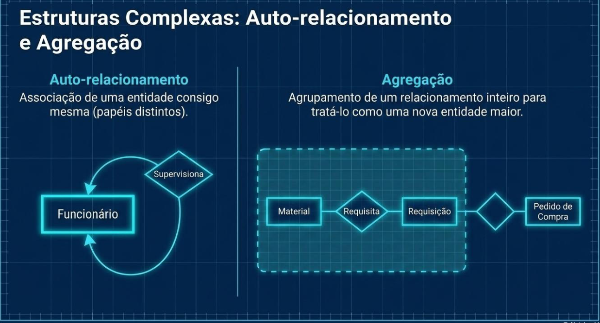
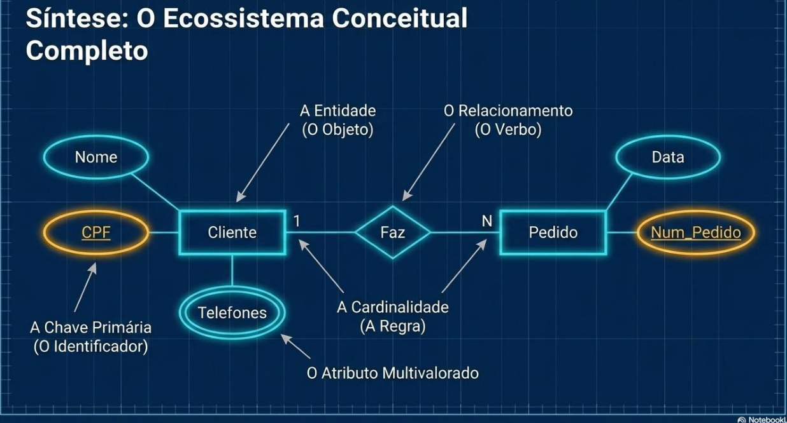
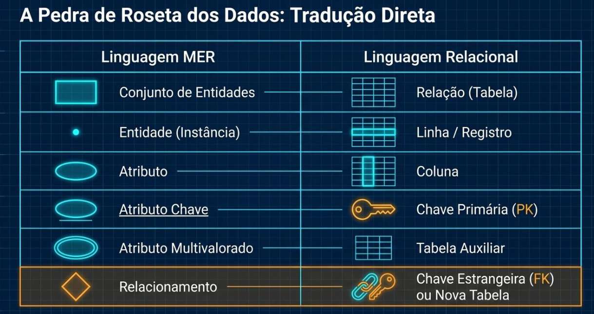
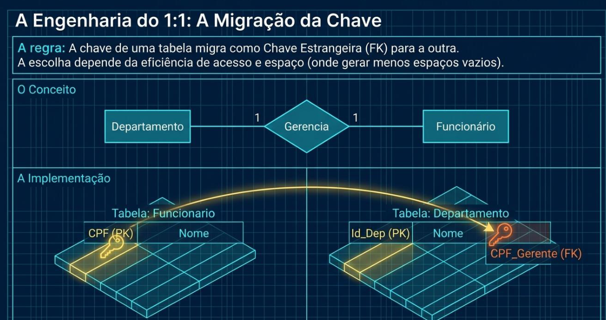
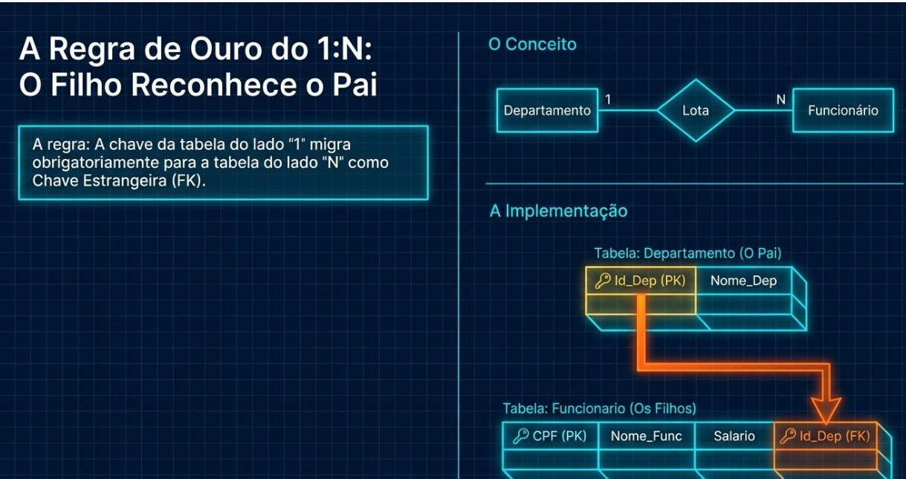
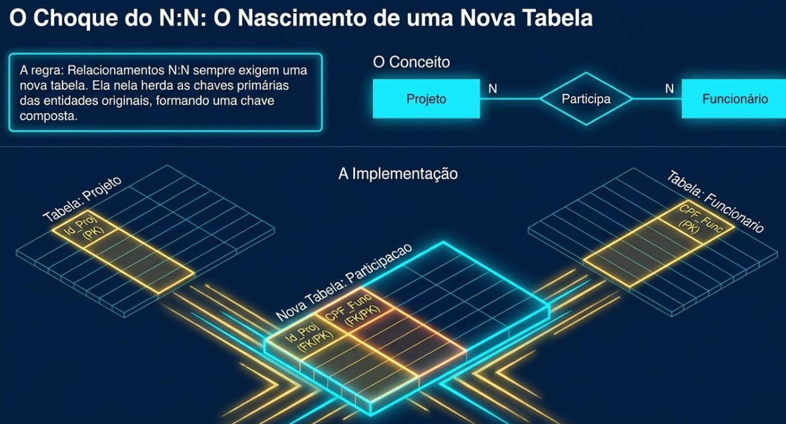

# Aula 02 - o Modelo Entidade-Relacionamento (MER)

## Conteúdo

1. A Força de Conexão: Relacionemento e Cardinalidade
2. Estruturas Complexas: Auto-relacionamento e Agregação
3. Síntase: O Ecossitema Conceitual Completo
4. A Pedra de Roseta dos Dados: Tradução Direta
5. A Engenharia do 1:1: A Migração da chave
6. A Regra de Ouro do 1:N: O Filho Reconhece o Pai
7. O Choque do N:N: O Nascimento de uma Nova Tabela

---

## 1. A Força de Conexão: Relacionamento e Cardinalidade

---

## 2. Estruturas Complexas: Auto-Relacionamento e Cardinalidade

---

## 3. Síntase: O Ecossistema Conceitual Completo

---

## 4. A Pedra de Roseta dos Dados: Tradução Direta

---

## 5. A Migração da Chave

---

## 6. A Regra de Ouro do 1:N: O Filho Reconhece o Pai

---

## 7. O Choque do N:N: O Nascimento de uma Nova Tabela

